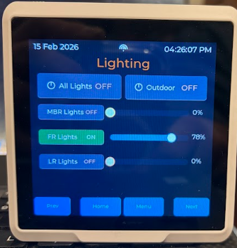

# ESPHome-Git

This repo is the source of truth for ESPHome configs. GitHub is the backup/central copy.

## Projects Included
- Septic Tank monitor, alarming, valve control w/ ESP-Now and Telegram Bot
- Pimroni Enviro+ Phat conversion to ESPHome/HA
- Several variations of IAQ Sensors ESPHome/HA - Focused on battery operation
- SenseCAP Indicator ESPHome Modular Setup ESPHome/HA

## SenseCAP Indicator D1S

Main Files: (v1)sensecap-d1s.yaml and (v2)sensecap-d1s-v2.yaml
v1 is stable, but not clean or fully modular.

## Quick Links
- [Project Status](#project-status)
- [What We Have Built So Far](#what-we-have-built-so-far)
- [Known State](#known-state)
- [Progress Images (2026-02-15)](#progress-images-2026-02-15)
- [Structure](#structure)
- [Repository Layout (SenseCAP Next)](#repository-layout-sensecap-next)
- [Multi-Device and Multi-Location Usage](#multi-device-and-multi-location-usage)
- [Write Policy](#write-policy)

## Project Status
This project has reached a stable milestone for daily testing and use, but it is **not complete**.

- Core SenseCAP D1S UI/navigation/runtime behavior is working.
- Home Assistant sync paths are mostly aligned.
- Sleep/idle scroll/boot behavior is much more reliable than earlier iterations.
- There is still more polish, cleanup, and feature hardening to do.

## What We Have Built So Far
- A modular ESPHome package layout for SenseCAP D1S.
- Multi-page LVGL interface with persistent navigation.
- Home, Home Clock, Settings, Admin, Overrides, Fans, Thermostat (V2 + Legacy), Lighting, Other Controls, Menu, and WiFi setup pages.
- Runtime gating so most page updates happen only when needed.
- Boot page handling, wake/sleep behavior, and idle scrolling.
- HA-integrated controls for thermostat, fans, lighting, lock, and key status fields.

## Known State
- Good progress and currently usable.
- Not final.
- Expect additional UX cleanup, refactors, and reliability improvements before calling this complete.

## Progress Images (2026-02-15)
Current UI snapshot set from `docs/images/sensecap-progress-2026-02-15/`.

### Boot Page

Boot orchestration screen with centered spinner and startup delay gating.
Files: [`packages/sensecap_next/base/ui_boot.yaml`](packages/sensecap_next/base/ui_boot.yaml), [`packages/sensecap_next/core_boot.yaml`](packages/sensecap_next/core_boot.yaml), [`packages/sensecap_next/base/ui_runtime_layout_finalize.yaml`](packages/sensecap_next/base/ui_runtime_layout_finalize.yaml)

### Home Page

Primary sensor dashboard for IAQ/comfort summary and quick status.
Files: [`packages/sensecap_next/features/home/home_lvgl.yaml`](packages/sensecap_next/features/home/home_lvgl.yaml), [`packages/sensecap_next/features/home/home_runtime.yaml`](packages/sensecap_next/features/home/home_runtime.yaml), [`packages/sensecap_next/features/home/home_ha.yaml`](packages/sensecap_next/features/home/home_ha.yaml)

### Automation Overrides Page

Manual override toggles for key HA automation gates.
Files: [`packages/sensecap_next/features/overrides/overrides_lvgl.yaml`](packages/sensecap_next/features/overrides/overrides_lvgl.yaml), [`packages/sensecap_next/features/overrides/overrides_actions.yaml`](packages/sensecap_next/features/overrides/overrides_actions.yaml), [`packages/sensecap_next/features/overrides/overrides_ha.yaml`](packages/sensecap_next/features/overrides/overrides_ha.yaml)

### Fan Controls Page

Speed/direction controls and attic fan toggles tied to HA entities.
Files: [`packages/sensecap_next/features/fans/fans_lvgl.yaml`](packages/sensecap_next/features/fans/fans_lvgl.yaml), [`packages/sensecap_next/features/fans/fans_actions.yaml`](packages/sensecap_next/features/fans/fans_actions.yaml), [`packages/sensecap_next/features/fans/fans_runtime.yaml`](packages/sensecap_next/features/fans/fans_runtime.yaml)

### Thermostat v2 Page

Arc-based thermostat layout with HVAC and fan mode controls.
Files: [`packages/sensecap_next/features/thermostat/thermostat_lvgl.yaml`](packages/sensecap_next/features/thermostat/thermostat_lvgl.yaml), [`packages/sensecap_next/features/thermostat/thermostat_actions.yaml`](packages/sensecap_next/features/thermostat/thermostat_actions.yaml), [`packages/sensecap_next/features/thermostat/thermostat_runtime.yaml`](packages/sensecap_next/features/thermostat/thermostat_runtime.yaml)

### Thermostat v1 (Legacy) Page

Legacy thermostat UI bound to the same HA state/control path as v2.
Files: [`packages/sensecap_next/features/thermostat/thermostat_lvgl.yaml`](packages/sensecap_next/features/thermostat/thermostat_lvgl.yaml), [`packages/sensecap_next/features/thermostat/thermostat_ha.yaml`](packages/sensecap_next/features/thermostat/thermostat_ha.yaml)

### Lighting Page

Grouped light toggles and brightness sliders with HA sync.
Files: [`packages/sensecap_next/features/lighting/lighting_lvgl.yaml`](packages/sensecap_next/features/lighting/lighting_lvgl.yaml), [`packages/sensecap_next/features/lighting/lighting_actions.yaml`](packages/sensecap_next/features/lighting/lighting_actions.yaml), [`packages/sensecap_next/features/lighting/lighting_runtime.yaml`](packages/sensecap_next/features/lighting/lighting_runtime.yaml)

### Other Controls Page

Additional controls page for non-HVAC/non-lighting endpoints (e.g., door lock).
Files: [`packages/sensecap_next/features/other_controls/other_controls_lvgl.yaml`](packages/sensecap_next/features/other_controls/other_controls_lvgl.yaml), [`packages/sensecap_next/features/other_controls/other_controls_actions.yaml`](packages/sensecap_next/features/other_controls/other_controls_actions.yaml), [`packages/sensecap_next/features/other_controls/other_controls_runtime.yaml`](packages/sensecap_next/features/other_controls/other_controls_runtime.yaml)

### Menu Page

Category launchpad for direct navigation across all enabled pages.
Files: [`packages/sensecap_next/features/menu/menu_lvgl.yaml`](packages/sensecap_next/features/menu/menu_lvgl.yaml), [`packages/sensecap_next/features/menu/menu_bundle.yaml`](packages/sensecap_next/features/menu/menu_bundle.yaml)

### Display Settings Page

Controls for brightness, idle scroll delay/rate, and display sleep behavior.
Files: [`packages/sensecap_next/features/settings/settings_lvgl.yaml`](packages/sensecap_next/features/settings/settings_lvgl.yaml), [`packages/sensecap_next/features/settings/settings_page_runtime.yaml`](packages/sensecap_next/features/settings/settings_page_runtime.yaml), [`packages/sensecap_next/features/settings/settings_actions.yaml`](packages/sensecap_next/features/settings/settings_actions.yaml)

### WiFi Setup Page

On-device SSID/password editing and connect/save workflow with keyboard.
Files: [`packages/sensecap_next/features/wifi/wifi_lvgl.yaml`](packages/sensecap_next/features/wifi/wifi_lvgl.yaml), [`packages/sensecap_next/features/wifi/wifi_actions.yaml`](packages/sensecap_next/features/wifi/wifi_actions.yaml), [`packages/sensecap_next/features/wifi/wifi_runtime.yaml`](packages/sensecap_next/features/wifi/wifi_runtime.yaml)

### Admin Panel Page

System diagnostics and service actions (WiFi, restart, factory reset).
Files: [`packages/sensecap_next/features/admin/admin_lvgl.yaml`](packages/sensecap_next/features/admin/admin_lvgl.yaml), [`packages/sensecap_next/features/admin/admin_page_runtime.yaml`](packages/sensecap_next/features/admin/admin_page_runtime.yaml), [`packages/sensecap_next/features/admin/admin_actions.yaml`](packages/sensecap_next/features/admin/admin_actions.yaml)

## Structure
```text
ESPHome-Git/
  custom_components/   # custom ESPHome components (planned migration to external_components)
  fonts/               # font files
  icon_s/              # svg/png icons
  packages/            # reusable packages only
    shared/            # wifi, fonts, icons, etc.
    sensecap/          # SenseCAP-specific packages - v1/Legacy
    sensecap_next/     # v2 specific files - migration files
  projects/            # full projects / device configs
  boards/              # board pinouts / substitutions
  devices/             # modified files specific to a single device id
  docs/                # cheatsheets, pinouts, notes
```

## Workflow (Short)
1. Edit on laptop repo.
2. Commit + push to GitHub.
3. Deploy to Home1/Home2 via robocopy (no Git on Home targets).

See `docs/ESPHome-Git-Cheatsheet.md` for full commands and details.


## Repository Layout (SenseCAP Next)

This section reflects the current v2 modular architecture and how it scales across devices and locations.

```text
/config/esphome/
  sensecap-d1s-v2.yaml                 # active next stack main (profile + device include only)
  sensecap-d1s.yaml                    # v1 stable stack (kept independent)

  packages/
    sensecap/                          # v1 legacy packages (do not modify for v2 changes)
    sensecap_next/
      base/                            # hardware/display/fonts/icons/topbar/boot primitives
      core_*.yaml                      # orchestration, globals, nav, shared HA bindings
      profile_*.yaml                   # full/minimal/debug + profile core wiring
      features/
        <feature>/
          <feature>_bundle.yaml
          <feature>_lvgl.yaml
          <feature>_ha.yaml
          <feature>_runtime.yaml
          <feature>_actions.yaml

  devices/
    <device_id>/
      device_profile.yaml              # include wiring for that device
      device_entities.yaml             # device-specific HA entity mappings
      device_endpoints.yaml            # device-specific ESP-Now/MQTT/Telegram endpoints

  docs/
    SOW-sensecap-next-modularization.md
```

### Multi-Device and Multi-Location Usage
1. Create one folder per panel under `devices/<device_id>/`.
2. Keep shared logic in `packages/sensecap_next/`.
3. Keep per-device/per-site mappings in `device_entities.yaml` and `device_endpoints.yaml`.
4. Use `site_id` substitution in each main/device profile for location-specific routing/naming.
5. Keep secrets in ESPHome secrets, not in package files.
6. Use `profile_full` for full UX panels and `profile_minimal` for lightweight panels.

### Write Policy
- Runtime files should be read/sync/update only.
- HA/service writes should be centralized in actions files and triggered by explicit user action.


